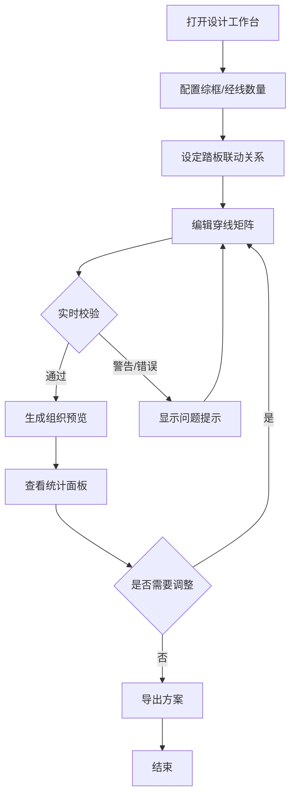

## 1. 产品概述

织工综框穿线设计系统——面向手工织造从业者与爱好者，提供可视化的综框穿线顺序编排工具，实时预览织物组织结构，自动检测错穿、浮线过长、踏板未关联等问题，降低织造试错成本。

- 核心价值：将传统凭经验的穿线设计数字化，提前发现无法形成的组织结构，避免上机后返工
- 目标用户：手工织造从业者、纺织专业学生、织造爱好者

## 2. 核心功能

### 2.1 用户角色

无角色区分，单一用户使用场景。

### 2.2 功能模块

1. **设计工作台**：穿线矩阵编辑、参数配置、踏板联动设定、织物组织预览、统计面板、导入导出

### 2.3 页面详情

| 页面名称 | 模块名称 | 功能描述 |
|---------|---------|---------|
| 设计工作台 | 参数配置面板 | 配置综框数量、经线数量、最大允许浮线长度；数量变更时校验大于零 |
| 设计工作台 | 踏板联动配置 | 为每个踏板设定关联的综框组合，支持多综框联动；未关联综框的踏板给出警告 |
| 设计工作台 | 穿线矩阵 | 可编辑矩阵，行为综框、列为经线；每根经线必须且只能选中一个综框；点击切换穿线状态 |
| 设计工作台 | 织物组织预览 | 基于穿线矩阵与踏板联动，实时生成经纬交织的组织图；浮线超长区域标红 |
| 设计工作台 | 统计面板 | 显示浮线长度分布、经线使用情况（各综框穿线数）、潜在错穿位置列表 |
| 设计工作台 | 导入/导出 | 支持 JSON 格式导入导出穿线方案；导入时校验，错误方案不覆盖当前设计 |

## 3. 核心流程

用户打开设计工作台 → 配置综框数量与经线数量 → 设定踏板联动关系 → 在穿线矩阵中安排每根经线穿过的综框 → 系统实时生成织物组织预览 → 查看统计面板发现问题 → 调整穿线方案 → 导出方案

## 4. 用户界面设计

### 4.1 设计风格

- **主色调**：深靛蓝 (#1a1a2e) 为底，配合暖金 (#e8b84b) 作为强调色，营造织造工坊的沉稳质感
- **辅助色**：米白 (#f5f0e8) 用于内容区，暗红 (#c0392b) 用于错误/警告标红
- **按钮风格**：圆角矩形，微弱阴影，hover 时轻微上浮
- **字体**：标题使用 Noto Serif SC，正文使用 Noto Sans SC，营造工整专业感
- **布局风格**：左侧参数配置 + 中间穿线矩阵 + 右侧预览与统计，三栏布局
- **图标风格**：线性图标，线条粗细一致

### 4.2 页面设计概览

| 页面名称 | 模块名称 | UI 元素 |
|---------|---------|---------|
| 设计工作台 | 参数配置面板 | 输入框（综框数/经线数/浮线阈值）、警告标签、折叠面板 |
| 设计工作台 | 踏板联动配置 | 复选框矩阵、警告徽标、添加/删除踏板按钮 |
| 设计工作台 | 穿线矩阵 | 可点击格子矩阵、行头综框编号、列头经线编号、选中高亮、错穿标红 |
| 设计工作台 | 织物组织预览 | ECharts 热力图/矩阵图、浮线标红、图例说明、缩放控制 |
| 设计工作台 | 统计面板 | 数字卡片（浮线/经线/错穿统计）、进度条、问题列表 |
| 设计工作台 | 导入/导出 | 上传按钮、导出按钮、导入校验结果提示 |

### 4.3 响应式设计

桌面优先设计，三栏布局在宽屏下最优；中等屏幕下右侧预览区折叠到底部；窄屏下单栏纵向排列。

### 4.4 3D 场景

不适用。
