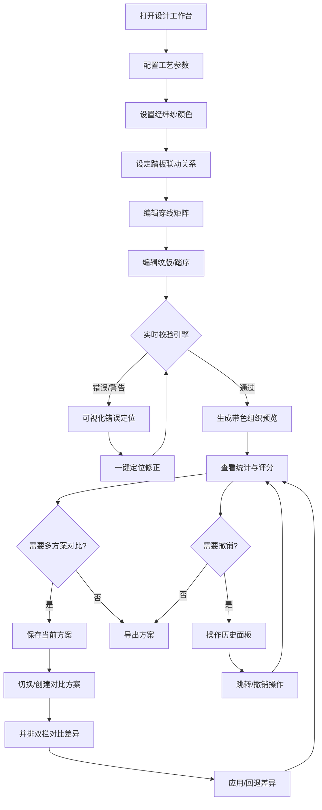

## 1. 产品概述

完整织造工艺设计工作台——面向手工织造从业者与爱好者，提供从综框穿线、纹版踏序到可织性校验的全流程设计工具，支持经纬纱颜色与组织叠加预览，多方案对比与差异高亮，导入导出版本兼容与撤销重做，将传统织造工艺数字化、智能化。

- **核心价值**：全流程工艺设计数字化，提前发现可织性问题，支持多方案迭代对比，避免上机后返工
- **目标用户**：手工织造从业者、纺织专业学生、织造爱好者、工艺设计师
- **版本**：2.0.0（从 1.0.0 穿线设计器升级）

## 2. 核心功能

### 2.1 用户角色

无角色区分，单一用户使用场景。

### 2.2 功能模块

1. **设计工作台**：参数配置、综框穿线矩阵、纹版/踏序编辑、织物组织预览、统计面板
2. **校验引擎**：错穿检测、空踏检测、悬浮过长、不可形成组织、综框未使用、踏序缺失、重复踏序、整列空穿
3. **方案管理**：方案保存、方案列表、多方案对比、差异高亮
4. **历史管理**：撤销重做、操作历史、版本快照
5. **数据交互**：导入导出（版本兼容）、颜色配置、可视化错误定位

### 2.3 页面详情

| 页面名称 | 模块名称 | 功能描述 |
|---------|---------|---------|
| 设计工作台 | 参数配置面板 | 配置综框数量、经线数量、最大允许浮线长度、纬线数量；数量变更时校验大于零 |
| 设计工作台 | 颜色配置面板 | 设置经线颜色、纬线颜色；支持颜色选择器、预设色板；实时叠加到组织预览 |
| 设计工作台 | 踏板联动配置 | 为每个踏板设定关联的综框组合，支持多综框联动；未关联综框的踏板给出警告 |
| 设计工作台 | 穿线矩阵 | 可编辑矩阵，行为综框、列为经线；每根经线必须且只能选中一个综框；点击切换穿线状态；支持拖拽连续穿线 |
| 设计工作台 | 纹版/踏序编辑 | 点画式踏序矩阵，行为踏板步、列为经线；点击切换提起/落下状态；支持画笔模式快速绘制；踏序序列显示 |
| 设计工作台 | 织物组织预览 | 基于穿线矩阵与踏序，实时生成经纬交织的组织图；经纬纱颜色叠加显示；浮线超长区域标红；支持缩放、图例说明 |
| 设计工作台 | 校验规则面板 | 展示可织性校验规则库；可开关各规则；显示规则说明与严重程度；一键定位错误位置 |
| 设计工作台 | 统计面板 | 显示浮线长度分布、经线使用情况（各综框穿线数）、潜在错穿位置列表、可织性评分 |
| 设计工作台 | 方案管理面板 | 保存当前方案为命名方案；方案列表展示与切换；删除方案；设置基准方案 |
| 设计工作台 | 方案对比面板 | 并排双栏对比两个方案；参数、穿线、踏序差异高亮；差异数量统计；一键应用差异 |
| 设计工作台 | 历史操作面板 | 显示操作历史列表；支持点击跳转到任意历史状态；撤销重做按钮；快捷键 Ctrl+Z/Y |
| 设计工作台 | 导入/导出 | 支持 JSON 格式导入导出；多版本兼容（支持 v1.x 方案导入）；导入时版本迁移提示；导出时可选包含历史 |

## 3. 核心流程

用户打开设计工作台 → 配置工艺参数（综框/经线/纬线/浮线阈值）→ 设置经纬纱颜色 → 设定踏板联动关系 → 编辑穿线矩阵 → 编辑纹版/踏序 → 系统实时校验与组织预览 → 查看错误定位并修正 → 保存方案 → 与其他方案对比 → 导出最终方案



## 4. 可织性校验规则库

### 4.1 核心规则集

| 规则ID | 规则名称 | 严重程度 | 检测逻辑 | 定位方式 |
|--------|---------|---------|---------|---------|
| R001 | 错穿 | 错误 | 经线穿过不存在的综框；经线同时穿过多个综框 | 高亮对应经线列 |
| R002 | 空踏 | 警告 | 某一踏板步所有经线状态一致（全提或全落），无交织 | 高亮对应踏板行 |
| R003 | 悬浮过长 | 警告 | 经向或纬向连续浮线超过设定阈值 | 高亮连续浮线区域 |
| R004 | 不可形成组织 | 错误 | 所有经线提落模式完全相同，不存在交织结构 | 全局提示 |
| R005 | 综框未使用 | 警告 | 某一综框无任何经线穿过 | 高亮对应综框行 |
| R006 | 踏序缺失 | 错误 | 某一踏板步未关联任何综框；踏序矩阵全空 | 高亮对应踏板行 |
| R007 | 重复踏序 | 信息 | 连续多个踏板步踏序完全相同，可能造成浪费 | 标注重复序列 |
| R008 | 整列空穿 | 错误 | 某一经线未穿过任何综框 | 高亮对应经线列 |

### 4.2 规则配置

- 支持单独开启/关闭每条规则
- 支持设置严重程度（错误/警告/信息）
- 规则说明与修复建议展示

## 5. 用户界面设计

### 5.1 设计风格

- **主色调**：深靛蓝 (#1a1a2e) 为底，配合暖金 (#e8b84b) 作为强调色，营造织造工坊的沉稳质感
- **辅助色**：米白 (#f5f0e8) 用于内容区，暗红 (#c0392b) 用于错误标红，橙色 (#e67e22) 用于警告标红，绿色 (#27ae60) 用于成功/新增差异，蓝色 (#3498db) 用于修改差异，紫色 (#8e44ad) 用于删除差异
- **按钮风格**：圆角矩形，微弱阴影，hover 时轻微上浮，危险操作二次确认
- **字体**：标题使用 Noto Serif SC，正文使用 Noto Sans SC，营造工整专业感
- **布局风格**：顶部工具栏 + 左侧配置区 + 中间编辑区 + 右侧预览统计区，支持 Tab 切换不同编辑模式
- **图标风格**：线性图标，线条粗细一致

### 5.2 页面布局

```
┌─────────────────────────────────────────────────────────────────────┐
│  品牌标识    [撤销][重做][保存方案][方案对比][导入][导出]  可织性评分 │
├──────────┬──────────────────────────┬──────────────────────────────┤
│ 参数配置 │  穿线矩阵  │  踏序编辑  │  组织预览（带色）             │
│ 颜色配置 │   [Tab]   │   [Tab]    │  ┌────────────────────┐      │
│ 踏板联动 │                          │  │ 经线色 ■ 纬线色 ■  │      │
│ 校验规则 │  ┌─────穿线矩阵─────┐  │  └────────────────────┘      │
│ 方案管理 │  │  1 2 3 4 5 ...   │  │                              │
│ 历史操作 │  │1 ■ □ ■ □ ...    │  │  浮线警告 ×12                 │
│          │  │2 □ ■ □ ■ ...    │  │                              │
│          │  │3 ■ □ ■ □ ...    │  │  [缩放控制]                   │
│          │  │4 □ ■ □ ■ ...    │  │                              │
│          │  └──────────────────┘  │  统计卡片区                   │
│          │                          │                              │
│          │  ┌─────踏序矩阵─────┐  │  问题列表（可定位）          │
│          │  │  1 2 3 4 5 ...   │  │  ┌────────────────────────┐ │
│          │  │1 ■ □ ■ □ ...    │  │  │ ⚠ 踏板3空踏    [定位]   │ │
│          │  │2 □ ■ □ ■ ...    │  │  │ ⚠ 经线7浮线过长 [定位]   │ │
│          │  │3 ■ □ ■ □ ...    │  │  └────────────────────────┘ │
│          │  └──────────────────┘  │                              │
└──────────┴──────────────────────────┴──────────────────────────────┘
```

### 5.3 方案对比布局

```
┌─────────────────────────────────────────────────────────────────────┐
│  方案对比: [方案A v1.2]  vs  [方案B v2.0]   差异总数: 24 处         │
├──────────────────────────┬──────────────────────────────────────────┤
│      基准方案 (方案A)     │           对比方案 (方案B)              │
│  ┌────────────────────┐  │  ┌──────────────────────────────────┐  │
│  │  参数: 综框4,经线24 │  │  │ 参数: 综框6,经线32  [差异 ▲]     │  │
│  └────────────────────┘  │  └──────────────────────────────────┘  │
│                          │                                          │
│  ┌─────穿线矩阵─────┐    │  ┌──────穿线矩阵（差异高亮）──────┐    │
│  │  1 2 3 4 ...     │    │  │  1 2 3 4 5 6 ...               │    │
│  │1 ■ □ ■ □ ...    │    │  │1 ■ □ ■ □ ■ □ ...  [新增行 ▲]  │    │
│  │2 □ ■ □ ■ ...    │    │  │2 □ ■ □ ■ □ ■ ...  [新增行 ▲]  │    │
│  │3 ■ □ ■ □ ...    │    │  │3 ■ □ ■ □ ■ □ ...  [新增行 ▲]  │    │
│  │4 □ ■ □ ■ ...    │    │  │4 □ ■ □ ■ □ ■ ...  [新增行 ▲]  │    │
│  └──────────────────┘    │  │5 ■ □ ■ □ ■ □ ...  [新增行 ▲]  │    │
│                          │  │6 □ ■ □ ■ □ ■ ...  [新增行 ▲]  │    │
│  可织性评分: 85/100       │  └──────────────────────────────────┘  │
│  错误: 0  警告: 3         │  可织性评分: 92/100 [差异 ▲ +7]        │
│                          │  错误: 0  警告: 2 [差异 ▼ -1]           │
├──────────────────────────┴──────────────────────────────────────────┤
│  差异详情: 参数变更 ×2 | 穿线差异 ×18 | 踏序差异 ×4  [全部应用]    │
└─────────────────────────────────────────────────────────────────────┘
```

### 5.4 页面设计概览

| 页面名称 | 模块名称 | UI 元素 |
|---------|---------|---------|
| 设计工作台 | 顶部工具栏 | 撤销/重做按钮、保存方案、方案对比、导入/导出、可织性评分徽章 |
| 设计工作台 | 参数配置面板 | 输入框（综框数/经线数/纬线数/浮线阈值）、颜色选择器、预设色板 |
| 设计工作台 | 颜色配置面板 | 经线颜色选择器、纬线颜色选择器、预设色板、颜色预览条 |
| 设计工作台 | 踏板联动配置 | 复选框矩阵、警告徽标、添加/删除踏板按钮 |
| 设计工作台 | 穿线矩阵 | 可点击格子矩阵、行头综框编号、列头经线编号、选中高亮、错穿标红、拖拽连续穿线 |
| 设计工作台 | 踏序编辑 | Tab切换、点画式矩阵、画笔模式切换、踏序序列显示、快捷填充按钮 |
| 设计工作台 | 织物组织预览 | ECharts 热力图、经纬纱颜色叠加、浮线标红、图例说明、缩放控制、颜色叠加开关 |
| 设计工作台 | 校验规则面板 | 规则开关列表、严重程度徽章、规则说明、一键修复按钮 |
| 设计工作台 | 统计面板 | 数字卡片、可织性评分、浮线分布图表、问题列表（带定位按钮） |
| 设计工作台 | 方案管理面板 | 方案列表、命名输入框、保存/删除按钮、设为基准、快速切换 |
| 设计工作台 | 方案对比面板 | 并排双栏布局、差异高亮、差异统计、差异详情、应用/回退按钮 |
| 设计工作台 | 历史操作面板 | 操作时间线、操作描述、跳转按钮、当前位置标记、撤销重做按钮 |
| 设计工作台 | 导入/导出 | 上传按钮、导出按钮、版本选择、导入校验、版本迁移提示 |

### 5.5 交互防误操作

| 操作类型 | 防误机制 |
|---------|---------|
| 删除踏板/综框 | 二次确认对话框，显示影响范围（影响X根经线/Y个踏序步） |
| 清空穿线/踏序 | 二次确认，支持 Ctrl+Z 撤销 |
| 导入覆盖当前方案 | 确认对话框，显示新旧方案差异预览 |
| 切换方案未保存 | 提示保存当前方案，可选"保存"、"放弃"、"取消" |
| 删除已保存方案 | 二次确认，"删除后不可恢复"警示 |
| 参数大幅变更（>50%） | 提示"参数变更较大，可能导致现有穿线失效"，确认后执行 |
| 关闭页面/刷新 | 如有未保存更改，beforeunload 提示 |

### 5.6 响应式设计

桌面优先设计，宽屏最优显示四栏布局；中等屏幕下右侧预览区折叠到底部；窄屏下单栏纵向排列，Tab 切换各面板。

### 5.7 3D 场景

不适用。

## 6. 数据版本兼容

### 6.1 版本历史

| 版本 | 主要变更 | 兼容性 |
|------|---------|-------|
| 1.0.0 | 初始穿线设计器 | 导入时自动迁移到 2.0.0 |
| 2.0.0 | 新增踏序编辑、颜色配置、方案管理、历史管理、扩展校验规则 | 当前版本 |

### 6.2 迁移规则

- v1.x 导入：自动生成默认踏序（与踏板关联相同）、默认经纬纱颜色、创建方案名称"导入方案 v1.x"
- 导入时检测版本，低版本导入给出版本迁移提示
- 导出时标注当前版本号，保留向前兼容字段
