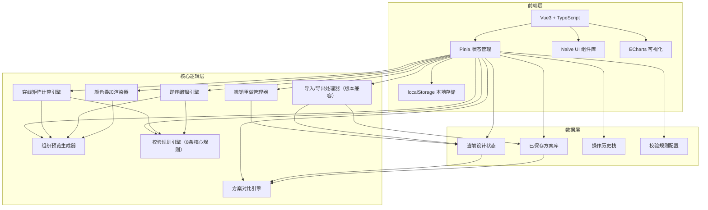
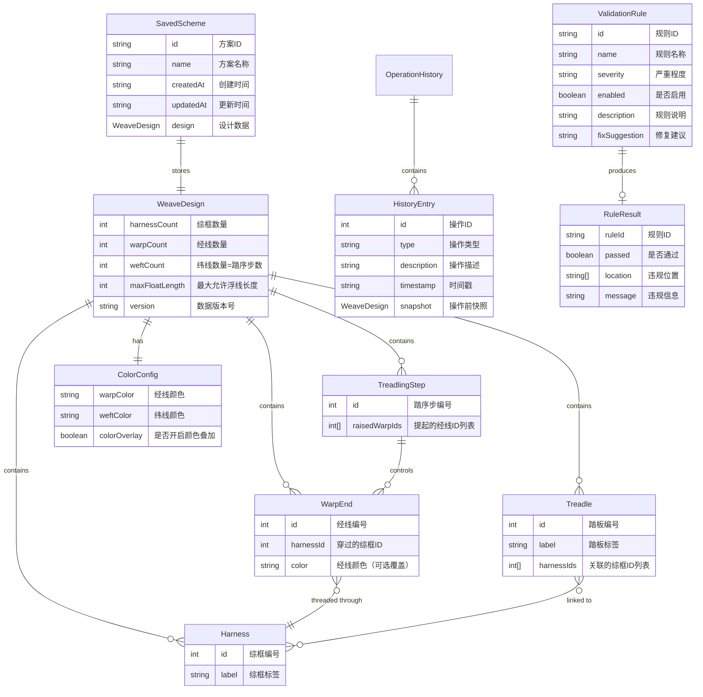

## 1. 架构设计



纯前端项目，无后端服务。所有计算在客户端完成，数据持久化使用 localStorage。

## 2. 技术说明

- **前端框架**：Vue3 + TypeScript + Vite
- **初始化工具**：vite-init（vue-ts 模板）
- **状态管理**：Pinia（模块化：weave, history, schemes, validation）
- **UI 组件库**：Naive UI
- **可视化**：ECharts（热力图/矩阵图展示组织预览、柱状图展示统计）
- **样式**：Tailwind CSS + CSS 变量主题
- **本地存储**：localStorage（方案库、操作历史、用户配置）
- **后端**：无
- **数据库**：无（方案导入导出为 JSON 文件）

## 3. 模块划分

| Store 模块 | 职责 | 核心状态 |
|-----------|------|---------|
| weave | 核心设计状态管理 | harnessCount, warpCount, weftCount, maxFloatLength, warpColor, weftColor, harnesses, warpEnds, treadles, treadlingMatrix |
| history | 撤销重做与操作历史 | past, future, currentIndex, operationHistory |
| schemes | 方案管理与对比 | savedSchemes, currentSchemeId, baseSchemeId, compareSchemeId, diffResult |
| validation | 校验规则引擎 | ruleConfigs, ruleResults, violationLocations |

## 4. 新增组件清单

| 组件名 | 路径 | 功能描述 |
|-------|------|---------|
| TopToolbar | @/components/TopToolbar.vue | 顶部工具栏：撤销/重做、保存方案、方案对比、导入导出、可织性评分 |
| ColorConfig | @/components/ColorConfig.vue | 颜色配置面板：经线/纬线颜色选择器、预设色板 |
| TreadlingEditor | @/components/TreadlingEditor.vue | 踏序编辑器：点画式矩阵、画笔模式、踏序序列 |
| ValidationRules | @/components/ValidationRules.vue | 校验规则面板：规则开关、严重程度、一键定位 |
| SchemeManager | @/components/SchemeManager.vue | 方案管理面板：方案列表、保存/删除、切换基准 |
| SchemeCompare | @/components/SchemeCompare.vue | 方案对比面板：并排双栏、差异高亮、应用差异 |
| HistoryPanel | @/components/HistoryPanel.vue | 历史操作面板：操作时间线、跳转、撤销重做 |

## 5. 路由定义

| 路由 | 用途 |
|------|------|
| / | 设计工作台主页，包含所有核心功能模块 |
| /compare | 方案对比页面（可选，也可使用模态框） |

单页应用，方案对比可使用模态框实现，无需独立路由。

## 6. API 定义

无后端 API，所有数据在客户端处理。

### 6.1 本地存储键

| 键名 | 存储内容 |
|------|---------|
| weave:schemes | 已保存的方案列表 |
| weave:history | 操作历史（可选，会话级） |
| weave:validationConfig | 校验规则配置 |
| weave:lastDesign | 上次关闭时的设计状态 |
| weave:colorConfig | 颜色配置 |

## 7. 服务端架构

不适用。

## 8. 数据模型

### 8.1 数据模型定义



### 8.2 数据定义语言

```typescript
// ===== 核心类型 =====

interface Harness {
  id: number
  label: string
}

interface WarpEnd {
  id: number
  harnessId: number | null
  color?: string
}

interface Treadle {
  id: number
  label: string
  harnessIds: number[]
}

interface TreadlingStep {
  id: number
  raisedWarpIds: number[]
}

interface ColorConfig {
  warpColor: string
  weftColor: string
  colorOverlay: boolean
}

interface WeaveDesign {
  version: string
  harnessCount: number
  warpCount: number
  weftCount: number
  maxFloatLength: number
  harnesses: Harness[]
  warpEnds: WarpEnd[]
  treadles: Treadle[]
  treadlingSteps: TreadlingStep[]
  colorConfig: ColorConfig
}

// ===== 预览与校验类型 =====

interface ThreadingMatrix {
  rows: number
  cols: number
  data: (0 | 1)[][]
}

interface TreadlingMatrix {
  rows: number
  cols: number
  data: (0 | 1)[][]
}

interface FloatWarning {
  startWarp: number
  endWarp: number
  startWeft?: number
  endWeft?: number
  type: 'warp' | 'weft'
  length: number
}

interface WeavePreview {
  matrix: number[][]
  coloredMatrix?: string[][]
  floatWarnings: FloatWarning[]
}

// ===== 校验规则类型 =====

type Severity = 'error' | 'warning' | 'info'

interface ValidationRule {
  id: string
  name: string
  severity: Severity
  enabled: boolean
  description: string
  fixSuggestion: string
}

interface ViolationLocation {
  type: 'harness' | 'warp' | 'weft' | 'treadle' | 'cell'
  harnessId?: number
  warpId?: number
  weftId?: number
  treadleId?: number
  cell?: { row: number; col: number }
}

interface RuleResult {
  ruleId: string
  passed: boolean
  severity: Severity
  message: string
  locations: ViolationLocation[]
}

interface ValidationResult {
  isValid: boolean
  score: number
  results: RuleResult[]
  errors: RuleResult[]
  warnings: RuleResult[]
  infos: RuleResult[]
}

// ===== 方案与历史类型 =====

interface SavedScheme {
  id: string
  name: string
  createdAt: string
  updatedAt: string
  design: WeaveDesign
  isBase?: boolean
}

interface HistoryEntry {
  id: number
  type: 'threading' | 'treadling' | 'param' | 'color' | 'treadle' | 'import' | 'reset'
  description: string
  timestamp: string
  snapshot: WeaveDesign
}

interface DiffSegment {
  type: 'added' | 'removed' | 'modified' | 'unchanged'
  path: string
  oldValue?: any
  newValue?: any
}

interface CompareResult {
  paramDiffs: DiffSegment[]
  threadingDiffs: { warpId: number; oldHarness: number | null; newHarness: number | null }[]
  treadlingDiffs: { stepId: number; warpId: number; oldState: number; newState: number }[]
  totalDiffs: number
  scoreDiff: number
}

// ===== 统计类型 =====

interface DesignStats {
  warpUsage: Record<number, number>
  maxWarpFloat: number
  maxWeftFloat: number
  averageFloatLength: number
  errorCount: number
  warningCount: number
  infoCount: number
  totalWarps: number
  threadedWarps: number
  unthreadedWarps: number
  weavabilityScore: number
}

// ===== 导入导出类型 =====

interface ExportData {
  version: string
  exportedAt: string
  schemeName?: string
  includeHistory?: boolean
  design: WeaveDesign
  history?: HistoryEntry[]
}

interface ImportResult {
  success: boolean
  migrated: boolean
  sourceVersion: string
  targetVersion: string
  errors: string[]
  warnings: string[]
  design?: WeaveDesign
}
```

## 9. 撤销重做实现方案

### 9.1 数据结构

```typescript
interface HistoryState {
  past: HistoryEntry[]      // 撤销栈（旧 -> 新）
  future: HistoryEntry[]    // 重做栈（新 -> 旧）
  currentIndex: number      // 当前在历史中的位置
  maxHistory: number        // 最大历史记录数（默认 100）
}
```

### 9.2 操作类型

| 操作类型 | 触发时机 | 描述 |
|---------|---------|------|
| threading | setWarpHarness, 拖拽批量穿线 | 穿线矩阵变更 |
| treadling | toggleTreadlingCell, 画笔绘制 | 踏序矩阵变更 |
| param | setHarnessCount, setWarpCount 等 | 参数变更 |
| color | setWarpColor, setWeftColor | 颜色配置变更 |
| treadle | addTreadle, removeTreadle, toggleTreadleHarness | 踏板联动变更 |
| import | importDesign | 导入方案 |
| reset | resetDesign | 重置设计 |

### 9.3 核心方法

- `recordHistory(type, description)`: 在操作前记录快照到 past
- `undo()`: 将 current 推入 future，从 past 弹出恢复
- `redo()`: 将 current 推入 past，从 future 弹出恢复
- `jumpToHistory(index)`: 跳转到指定历史点
- `clearHistory()`: 清空历史记录

## 10. 校验规则引擎实现

### 10.1 规则定义

```typescript
const VALIDATION_RULES: ValidationRule[] = [
  {
    id: 'R001',
    name: '错穿检测',
    severity: 'error',
    enabled: true,
    description: '经线穿过不存在的综框，或同时穿过多个综框',
    fixSuggestion: '点击定位按钮，将经线分配到有效的综框'
  },
  {
    id: 'R002',
    name: '空踏检测',
    severity: 'warning',
    enabled: true,
    description: '某一踏板步所有经线状态一致，无交织',
    fixSuggestion: '调整该步的踏序，使部分经线提起、部分落下'
  },
  {
    id: 'R003',
    name: '悬浮过长',
    severity: 'warning',
    enabled: true,
    description: '经向或纬向连续浮线超过设定阈值',
    fixSuggestion: '调整穿线或踏序，缩短连续浮线长度'
  },
  {
    id: 'R004',
    name: '不可形成组织',
    severity: 'error',
    enabled: true,
    description: '所有经线提落模式完全相同，不存在交织结构',
    fixSuggestion: '将经线分配到不同综框，或调整踏板联动'
  },
  {
    id: 'R005',
    name: '综框未使用',
    severity: 'warning',
    enabled: true,
    description: '某一综框无任何经线穿过',
    fixSuggestion: '为该综框分配经线，或删除多余综框'
  },
  {
    id: 'R006',
    name: '踏序缺失',
    severity: 'error',
    enabled: true,
    description: '某一踏序步未控制任何经线，或踏序矩阵全空',
    fixSuggestion: '编辑踏序矩阵，为该步设置提起的经线'
  },
  {
    id: 'R007',
    name: '重复踏序',
    severity: 'info',
    enabled: true,
    description: '连续多个踏序步完全相同，可能造成浪费',
    fixSuggestion: '考虑合并重复步骤，或调整踏序节奏'
  },
  {
    id: 'R008',
    name: '整列空穿',
    severity: 'error',
    enabled: true,
    description: '某一经线未穿过任何综框',
    fixSuggestion: '点击定位按钮，为该经线选择综框'
  }
]
```

### 10.2 可织性评分算法

```
基础分: 100
每条错误: -15 分
每条警告: -5 分
每条信息: -1 分
未使用综框数 × -2 分
平均浮线长度 > 阈值 × -3 分
可织性评分: max(0, 基础分 - 所有扣分项)
```

## 11. 版本兼容实现

### 11.1 版本迁移器

```typescript
interface Migration {
  fromVersion: string
  toVersion: string
  migrate: (data: any) => WeaveDesign
}

const MIGRATIONS: Migration[] = [
  {
    fromVersion: '1.0.0',
    toVersion: '2.0.0',
    migrate: (v1Data) => {
      // 1. 生成默认踏序（从踏板联动生成）
      // 2. 添加默认颜色配置
      // 3. 补充 weftCount = treadles.length
      // 4. 版本号更新为 2.0.0
    }
  }
]
```

### 11.2 导入流程

1. 解析 JSON，读取 version 字段
2. 如版本 < 当前版本，查找对应迁移链
3. 逐步应用迁移，直到达到当前版本
4. 执行数据校验
5. 导入成功，显示迁移提示
