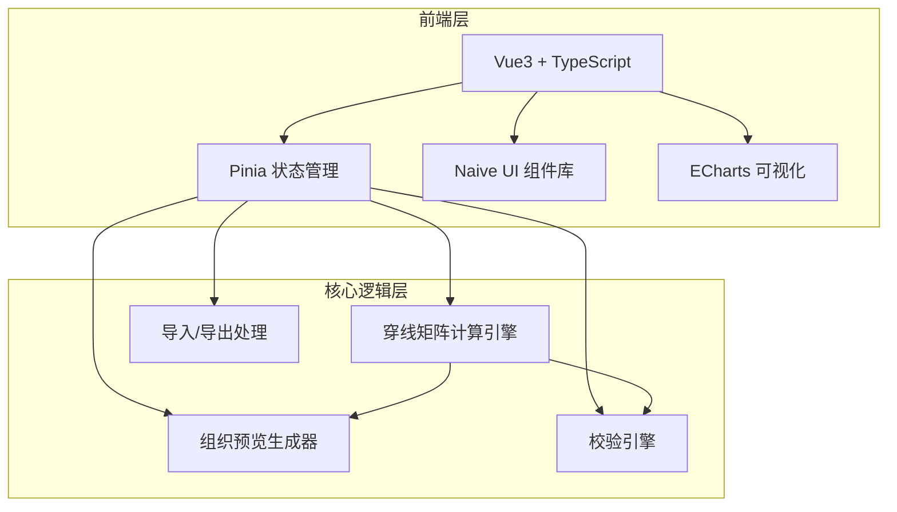
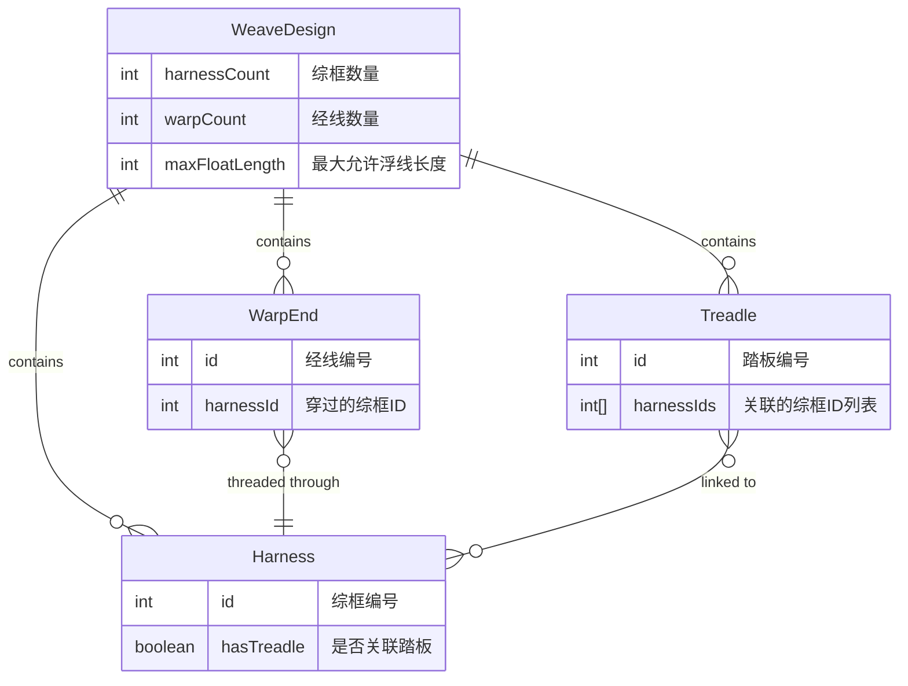

## 1. 架构设计



纯前端项目，无后端服务。所有计算在客户端完成。

## 2. 技术说明

- **前端框架**：Vue3 + TypeScript + Vite
- **初始化工具**：vite-init（vue-ts 模板）
- **状态管理**：Pinia
- **UI 组件库**：Naive UI
- **可视化**：ECharts（热力图/矩阵图展示组织预览）
- **样式**：Tailwind CSS
- **后端**：无
- **数据库**：无（方案导入导出为 JSON 文件）

## 3. 路由定义

| 路由 | 用途 |
|------|------|
| / | 设计工作台主页，包含所有核心功能模块 |

单页应用，无需多路由。

## 4. API 定义

无后端 API，所有数据在客户端处理。

## 5. 服务端架构

不适用。

## 6. 数据模型

### 6.1 数据模型定义



### 6.2 数据定义语言

```typescript
interface WeaveDesign {
  harnessCount: number
  warpCount: number
  maxFloatLength: number
  harnesses: Harness[]
  warpEnds: WarpEnd[]
  treadles: Treadle[]
}

interface Harness {
  id: number
  label: string
}

interface WarpEnd {
  id: number
  harnessId: number
}

interface Treadle {
  id: number
  label: string
  harnessIds: number[]
}

interface ThreadingMatrix {
  rows: number
  cols: number
  data: number[][]
}

interface WeavePreview {
  matrix: number[][]
  floatWarnings: FloatWarning[]
}

interface FloatWarning {
  startWarp: number
  endWarp: number
  type: 'warp' | 'weft'
  length: number
}

interface ValidationResult {
  isValid: boolean
  errors: string[]
  warnings: string[]
  floatWarnings: FloatWarning[]
  unthreadedWarps: number[]
  duplicateThreadedWarps: Map<number, number[]>
  unlinkedHarnesses: number[]
}

interface DesignStats {
  warpUsage: Map<number, number>
  maxFloatLength: number
  averageFloatLength: number
  errorCount: number
  warningCount: number
}
```
